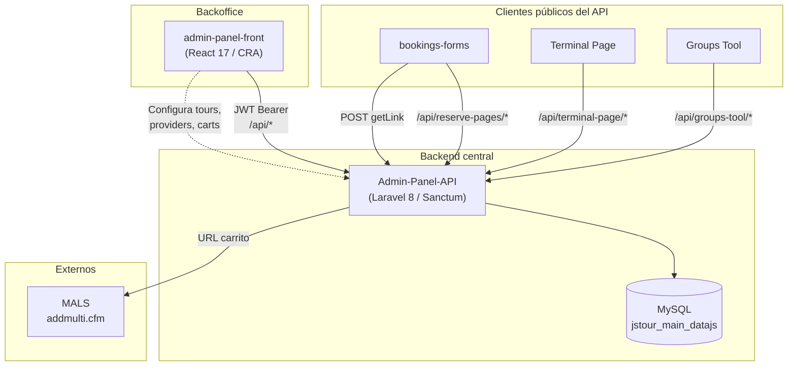
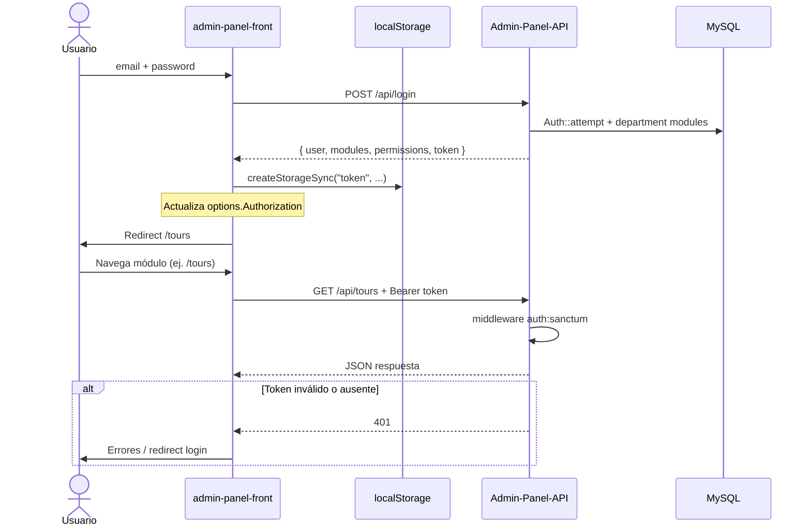
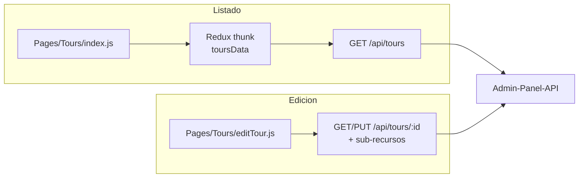
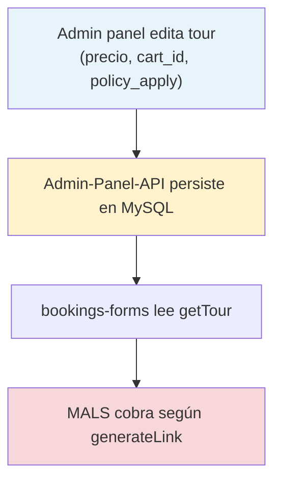

# Admin Panel Front

Panel de administración web para **Adventure Station** (Paradise Solutions). Desde aquí se gestionan tours, proveedores, operadores, catálogo, usuarios, permisos y configuración comercial.

Este documento está pensado para que un desarrollador nuevo pueda entender el proyecto, levantarlo en local y saber dónde tocar el código.

---

## Tabla de contenidos

- [Requisitos](#requisitos)
- [Instalación paso a paso (desde cero)](#instalación-paso-a-paso-desde-cero)
- [Inicio rápido (si ya tienes todo instalado)](#inicio-rápido-si-ya-tienes-todo-instalado)
- [Qué hace esta aplicación](#qué-hace-esta-aplicación)
- [Relación con Admin-Panel-API](#relación-con-admin-panel-api)
- [Estructura del proyecto](#estructura-del-proyecto)
- [Cómo funciona por dentro](#cómo-funciona-por-dentro)
- [Módulos principales](#módulos-principales)
- [Guía para desarrollar](#guía-para-desarrollar)
- [API y autenticación](#api-y-autenticación)
- [Estilos y UI](#estilos-y-ui)
- [Efectos secundarios y riesgos](#efectos-secundarios-y-riesgos)
- [Problemas frecuentes](#problemas-frecuentes)
- [Comandos útiles](#comandos-útiles)

---

## Requisitos

| Herramienta | Versión recomendada | Para qué sirve |
|-------------|---------------------|----------------|
| Node.js     | 16.x o 18.x (LTS)   | Motor que ejecuta el proyecto y trae `npm` |
| npm         | 8+ (viene con Node) | Instala las librerías y arranca la app |
| Git         | Última estable      | Descargar (clonar) el código del repositorio |
| VS Code     | Última estable      | Editor recomendado para leer/editar el código |
| Navegador   | Google Chrome       | Ver la app y usar las DevTools (pestaña Network) |

El proyecto usa **Create React App** (`react-scripts` 5) con **React 17**.

> **No necesitas saber React para levantarlo.** Esta guía te lleva de cero (equipo recién formateado) hasta ver el login en el navegador. La parte de "cómo está hecho por dentro" viene más abajo.

---

## Instalación paso a paso (desde cero)

Esta sección asume **Windows** y que **no tienes nada instalado** todavía. Si ya tienes Node, Git y VS Code, salta al [Inicio rápido](#inicio-rápido-si-ya-tienes-todo-instalado).

### Conceptos mínimos (30 segundos)

Antes de empezar, tres palabras que vas a ver todo el tiempo:

- **Node.js**: programa que permite ejecutar JavaScript fuera del navegador. Es lo que necesita el proyecto para funcionar.
- **npm**: el "gestor de paquetes" que viene incluido con Node. Descarga las librerías que el proyecto necesita (quedan en la carpeta `node_modules`) y ejecuta comandos como arrancar la app.
- **Git**: sistema para descargar y sincronizar el código del repositorio (clonar, actualizar, subir cambios).

No hace falta entender más para instalar. Vamos por pasos.

### Paso 1 — Instalar Node.js (incluye npm)

1. Entra a [https://nodejs.org](https://nodejs.org).
2. Descarga la versión **LTS** (recomendada: **18.x**). El instalador `.msi` de Windows trae Node **y npm** juntos.
3. Ejecuta el instalador y acepta todo por defecto (deja marcada la opción "Add to PATH").
4. **Cierra y vuelve a abrir** cualquier terminal que tuvieras abierta (para que reconozca los comandos nuevos).

> Si en tu equipo se manejan varias versiones de Node, pregunta si usan **nvm-windows** ([nvm-windows releases](https://github.com/coreybutler/nvm-windows/releases)) en lugar del instalador oficial. Para una primera instalación, el `.msi` oficial es suficiente.

### Paso 2 — Instalar Git

1. Entra a [https://git-scm.com/download/win](https://git-scm.com/download/win) y descarga el instalador.
2. Ejecútalo y acepta las opciones por defecto (son adecuadas para la mayoría).
3. Cierra y vuelve a abrir la terminal.

### Paso 3 — Instalar VS Code (editor)

1. Descárgalo desde [https://code.visualstudio.com](https://code.visualstudio.com) e instálalo.
2. (Opcional pero recomendado) instala las extensiones **ESLint** y **Prettier** desde el panel de extensiones.

### Paso 4 — Verificar que todo quedó instalado

Abre una terminal nueva. En Windows puedes usar **PowerShell** (busca "PowerShell" en el menú inicio) o la terminal integrada de VS Code (`Ctrl` + `` ` ``). Ejecuta uno por uno:

```powershell
node -v
npm -v
git --version
```

Deberías ver algo como `v18.20.0`, `10.x.x` y `git version 2.x`. Si algún comando dice *"no se reconoce"*, cierra la terminal, ábrela de nuevo y, si sigue fallando, reinstala esa herramienta asegurándote de dejar marcada la opción de agregar al PATH.

### Paso 5 — Obtener el código (clonar el repositorio)

1. Elige (o crea) una carpeta donde guardar proyectos. En este equipo el estándar es trabajar dentro de `C:\xampp\htdocs\sites`.
2. En la terminal, entra a esa carpeta y clona el repo. Pide la **URL del repositorio** a tu equipo:

```powershell
cd C:\xampp\htdocs\sites
git clone <url-del-repo> admin-panel-front
cd admin-panel-front
```

> La primera vez, Git puede pedirte iniciar sesión (GitHub/GitLab). Usa las credenciales que te dé tu equipo. Si el proyecto **ya está** en tu equipo (como en este caso, dentro de `C:\xampp\htdocs\sites\admin-panel-front`), solo entra a la carpeta con `cd` y sáltate el `git clone`.

### Paso 6 — Instalar las dependencias del proyecto

Estando **dentro** de la carpeta `admin-panel-front` (donde está el archivo `package.json`):

```powershell
npm install
```

Qué esperar:

- Tarda varios minutos la primera vez (descarga cientos de librerías a `node_modules`).
- Es **normal** ver mensajes amarillos de `warn` (deprecaciones, peer dependencies). No son errores; puedes ignorarlos.
- Solo preocúpate si aparece `ERR!` en rojo y el comando termina sin instalar. En ese caso revisa [Problemas frecuentes](#problemas-frecuentes).

> Si `npm install` falla por conflictos de versiones (peer dependencies), prueba `npm install --legacy-peer-deps`.

### Paso 7 — Arrancar la app

```powershell
npm start
```

Qué esperar:

- La terminal compila el proyecto y, al terminar, abre automáticamente el navegador en [http://localhost:3000](http://localhost:3000).
- Verás la **pantalla de login**. La terminal se queda "ocupada" mostrando `Compiled successfully!`: eso es correcto, significa que el servidor de desarrollo está corriendo.
- Cada vez que guardes un cambio en el código, la página se recarga sola (*hot reload*).
- Para **detener** el servidor, vuelve a la terminal y pulsa `Ctrl` + `C`.

### Paso 8 — Iniciar sesión

Por defecto el front apunta al **API de producción** (`api.paradisesolutions.com`), así que necesitas **credenciales reales** (email y contraseña) que te debe proporcionar tu equipo. No hay usuario de prueba genérico en este repositorio.

Tras un login correcto, la app te lleva a **`/tours`** (la pantalla principal de trabajo).

> Si quieres apuntar a un backend local en lugar de producción, revisa [API y autenticación](#api-y-autenticación) y [Configuración de entorno compartida](#configuración-de-entorno-compartida).

### ¿Y ahora qué?

Ya tienes el proyecto corriendo. A partir de aquí:

- Para **entender qué es y qué hace**, sigue con [Qué hace esta aplicación](#qué-hace-esta-aplicación).
- Para **saber dónde tocar el código**, ve a [Estructura del proyecto](#estructura-del-proyecto) y [Guía para desarrollar](#guía-para-desarrollar).
- Si algo salió mal en la instalación, revisa [Problemas frecuentes](#problemas-frecuentes).

---

## Inicio rápido (si ya tienes todo instalado)

Para quien ya tiene **Node 16/18, npm y Git** en su equipo:

```powershell
# 1. Clonar el repositorio (omite si ya lo tienes local)
git clone <url-del-repo> admin-panel-front
cd admin-panel-front

# 2. Instalar dependencias
npm install

# 3. Arrancar en modo desarrollo
npm start
```

La app se abre en [http://localhost:3000](http://localhost:3000).

Por defecto las peticiones van al API de producción (`api.paradisesolutions.com`). Necesitarás credenciales válidas para iniciar sesión. Si tu equipo usa un backend local, revisa la sección [API y autenticación](#api-y-autenticación).

---

## Qué hace esta aplicación

Es un **CRM / backoffice de turismo** con estas áreas de negocio:

- **Tours** — catálogo, precios, temporadas, horarios, addons, publicación web (módulo más grande).
- **Providers** — proveedores, contactos, métodos de pago, políticas operativas.
- **Operators** — operadores turísticos.
- **Catálogo** — categorías, tipos de tour, ubicaciones, websites.
- **Comercial** — carritos de compra, tipos de pago.
- **Administración** — usuarios, roles, departamentos y permisos por módulo.

El menú lateral solo muestra las secciones a las que el usuario tiene acceso según sus **módulos** asignados.

---

## Relación con Admin-Panel-API

Este frontend es el **cliente principal autenticado** del repositorio **[Admin-Panel-API](../Admin-Panel-API/)** (Laravel 8). No tiene base de datos propia: toda la persistencia, reglas de negocio y permisos reales viven en el API.

> Documentación complementaria del backend: [`Admin-Panel-API/README.md`](../Admin-Panel-API/README.md)

### Ecosistema JS Tour



El admin panel **configura** los datos que otros clientes **consumen** en reservas y operaciones (tours, precios, carritos, policies). Un cambio en `/tours/:id` o en un proveedor puede impactar booking forms y el monto cobrado en MALS sin tocar el front de reservas.

### Flujo de autenticación (front ↔ API)



**Contrato de login** — el front espera esta forma en `resp.data.data`:

| Campo | Uso en el front |
|-------|-----------------|
| `token` | JWT Sanctum → header `Authorization: Bearer …` |
| `user` | Datos del usuario logueado |
| `modules` | Array con `module_id` → filtra sidebar (`Sidebar.js`) |
| `permissions` | Permisos por rol (`permission_type_id`) |

Archivos que implementan este contrato:

- Login: `src/Pages/Auth/Login/index.js` → `LoginData()` → `createStorageSync("token", …)`
- HTTP global: `src/Utils/API/index.js` → `options`, `createStorageSync`
- Guard de rutas: `src/Utils/Routes/PrivateRoutes.js`

### Flujo típico CRUD (listado + edición)



Muchas pantallas de **edición** (Tours, Providers) llaman al API **directamente** desde `Utils/API/<Modulo>/` sin pasar por Redux. Al cambiar un endpoint en el backend, revisa tanto la capa Redux (listados) como las funciones Axios del módulo (formularios y tabs).

### Mapeo módulos front → API

| Ruta front | `module_id` | Carpeta `Utils/API/` | Recursos API principales |
|------------|-------------|----------------------|--------------------------|
| `/users` | 1 | `Users/` | `GET/POST/PUT /users` |
| `/departments` | 2 | `Departments/` | `GET/POST/PUT /departments` |
| `/roles` | 3 | `Roles/` | `GET/POST/PUT /roles` |
| `/websites` | 4 | `Websites/` | `GET/POST/PUT /websites` |
| `/tour-types` | 5 | `TourTypes/` | `GET/POST/PUT /tourtypes` |
| `/categories` | 6 | `Categories/` | `GET/POST/PUT /categories` |
| `/locations` | 7 | `Locations/` | `GET/POST/PUT /locations` |
| `/operators` | 8 | `Operators/` | `GET/POST/PUT /operators` |
| `/shopping-carts` | 12 | `ShoppingCarts/` | `GET/POST/PUT /carts` |
| `/payment-types` | 13 | `Payments/` | `GET/POST/PUT /payments` |
| `/providers` | 14 | `Providers/` | `GET/POST/PUT /providers`, `OperationalInfo/*` |
| `/tours` | 15 | `Tours/` | `GET/POST/PUT /tours`, `/prices`, `/addons`, `/schedules*` |

Los módulos **Tours** y **Providers** tienen la mayor cantidad de sub-endpoints (settings, seasons, payments, policies, assets). El API los expone bajo rutas anidadas documentadas en `Admin-Panel-API/routes/api.php`.

### Configuración de entorno compartida

| Entorno | URL API (front) | Notas |
|---------|-----------------|-------|
| Producción (default) | `https://api.paradisesolutions.com/api` | Hardcodeada en `Utils/API/index.js` |
| Local (opcional) | `http://localhost/Admin-Panel-API/api` | Código comentado en el mismo archivo |
| API local | Ver `.env` del backend | `DB_*`, `APP_URL`, Sanctum |

Para desarrollo full-stack: levantar el API (XAMPP/Apache o `php artisan serve`) y descomentar/adaptar la URL local en el front.

---

## Estructura del proyecto

```
admin-panel-front/
├── public/                 # HTML estático, favicon, manifest
├── src/
│   ├── index.js            # Entrada: Redux, Router, estilos globales
│   ├── App.js              # Monta el árbol de rutas principal
│   │
│   ├── Components/
│   │   ├── Layout/         # Header, Sidebar, Layout (shell autenticado)
│   │   ├── Common/         # Modales, tablas, componentes reutilizables
│   │   └── Assets/         # SCSS, imágenes, fuentes
│   │
│   ├── Pages/              # Pantallas por dominio (Tours, Providers, Users…)
│   │
│   └── Utils/
│       ├── API/            # Llamadas HTTP (Axios) por recurso
│       ├── Redux/          # Store, actions, reducers, types
│       ├── Routes/         # Definición de rutas públicas y privadas
│       └── CommonFunctions/
│
├── package.json
└── README.md
```

### Convención de carpetas por módulo

Cada dominio de negocio suele seguir este patrón:

| Ubicación | Rol |
|-----------|-----|
| `Pages/<Modulo>/index.js` | Listado principal |
| `Pages/<Modulo>/new*.js` | Crear registro |
| `Pages/<Modulo>/edit*.js` o `/:id` | Editar registro |
| `Pages/<Modulo>/*Cols.js` | Columnas de tablas |
| `Utils/Routes/<Modulo>Routes/` | Rutas del módulo |
| `Utils/API/<Modulo>/` | Endpoints Axios |
| `Utils/Redux/Actions|Reducers/<Modulo>/` | Estado global (si aplica) |

---

## Cómo funciona por dentro

### Flujo general

```
index.js
  └── Redux Provider
        └── BrowserRouter
              └── App.js → AppRoutes
                    ├── Rutas públicas  → /login, /forgot-password, /reset-password
                    └── Rutas privadas  → Layout + ContentRoutes (módulos)
```

### Autenticación

1. El login llama a `POST /login` y guarda la respuesta en **`localStorage`** bajo la clave `token`.
2. Ese objeto incluye el JWT y la lista de **`modules`** (permisos del usuario).
3. `PrivateRoutes` comprueba si existe `token`; si no, redirige a `/login`.
4. Tras un login correcto, la app lleva al usuario a **`/tours`** (pantalla principal de trabajo).

Archivos clave:

- `src/Pages/Auth/Login/index.js`
- `src/Utils/Routes/PrivateRoutes.js`
- `src/Utils/Routes/PublicRoutes.js`

### Rutas

| Archivo | Responsabilidad |
|---------|-----------------|
| `Utils/Routes/AppRoutes.js` | Divide público vs privado |
| `Utils/Routes/ContentRoutes.js` | Rutas autenticadas dentro del `Layout` |
| `Utils/Routes/<Modulo>Routes/` | Rutas de cada módulo (listado, new, edit) |

Ejemplo de rutas de Tours:

```
/tours       → listado
/tours/new   → crear tour
/tours/:id   → editar tour (pestañas internas)
```

### Estado global (Redux)

El store combina reducers por dominio:

`login`, `tours`, `providers`, `operators`, `users`, `roles`, `departments`, `categories`, `websites`, `tourTypes`, `carts`, `paymentTypes`, `locations`, `serviceArea`, `modules`.

- **Actions con thunk** — suelen cargar listados (ej. `toursData`, `providersData`).
- **Pantallas de edición** — muchas veces llaman a la API directamente sin pasar por Redux.

Store: `src/Utils/Redux/Store/index.js`

### Permisos en el menú

El sidebar (`Components/Layout/Sidebar.js`) filtra ítems según `userInfo.modules` y el `module_id`:

| ID | Módulo |
|----|--------|
| 1 | Users |
| 2 | Departments |
| 3 | Roles |
| 4 | Websites |
| 5 | Tour Types |
| 6 | Categories |
| 7 | Locations |
| 8 | Operators |
| 12 | Shopping Carts |
| 13 | Payment Types |
| 14 | Providers |
| 15 | Tours |

Si no ves una sección en el menú, el usuario no tiene ese módulo asignado (no es un bug del front).

---

## Módulos principales

| Ruta | Descripción | Complejidad |
|------|-------------|-------------|
| `/tours` | Gestión de tours (precios, schedules, addons, publish…) | Alta |
| `/providers` | Proveedores, pagos, operaciones | Alta |
| `/operators` | Operadores | Media |
| `/users` | Usuarios del panel | Media |
| `/roles` | Roles y permisos | Media |
| `/departments` | Departamentos y módulos | Media |
| `/categories` | Categorías | Baja |
| `/locations` | Ubicaciones | Baja |
| `/websites` | Sitios web | Baja |
| `/tour-types` | Tipos de tour | Baja |
| `/shopping-carts` | Carritos de compra | Media |
| `/payment-types` | Tipos de pago | Baja |
| `/dashboard` | Dashboard (existe ruta; el flujo principal usa `/tours`) | Baja |

Los módulos **Tours** y **Providers** concentran la mayor parte de la lógica y los modales.

**Assets (Boats) / wiki:** análisis del modal de boats, modelo de datos y relación con Group Tool, Dispatch y Database → [`src/Components/Common/Modals/AssetsModal/README.md`](src/Components/Common/Modals/AssetsModal/README.md).

**Pricing / Products / wiki:** características EAV por tipo de tour, `prices` / `products_temp`, `charter_types(_fishing)` y vínculo con activities → [`src/Components/Common/Modals/PricingModals/README.md`](src/Components/Common/Modals/PricingModals/README.md).

---

## Guía para desarrollar

### Patrón típico de una pantalla de listado

1. Dispatch de una action Redux (thunk) en `useEffect`.
2. Leer datos con `useSelector`.
3. Renderizar tabla (`TableContainer`, `react-bootstrap-table-next`, etc.).
4. Abrir modales en `Components/Common/Modals/` para crear/editar/eliminar.
5. Confirmaciones y errores con **SweetAlert2** (`Swal`).

### Patrón típico de una pantalla de edición

1. Obtener `id` con `useParams()`.
2. Cargar datos con funciones de `Utils/API/<Modulo>/`.
3. Organizar el contenido en **tabs** (Reactstrap `Nav` + `TabContent`).
4. Guardar con `PUT`/`POST` al API según el formulario.

### Añadir un endpoint nuevo

1. Crear o extender funciones en `src/Utils/API/<Recurso>/index.js`.
2. Usar `API_URL` y `options` importados desde `src/Utils/API/index.js`.
3. Si el listado debe estar en Redux, añadir action + reducer + type.

### Añadir una ruta nueva

1. Crear la página en `src/Pages/`.
2. Crear `src/Utils/Routes/<Modulo>Routes/index.js` (o extender el existente).
3. Registrar la ruta en `ContentRoutes.js`.
4. Si aplica, añadir entrada en `Sidebar.js` con el `module_id` correcto.

### Modales

La mayoría viven en `src/Components/Common/Modals/`. Antes de crear uno nuevo, busca si ya existe algo similar (pricing, schedules, payments, bulk edit, etc.).

### Tooltips

Para hints en iconos, celdas o labels, usar **`UncontrolledTooltip`** de **Reactstrap** (no Ant Design `Tooltip` ni Material-UI en módulos que ya siguen el patrón Bootstrap).

Patrón estándar:

```jsx
import { UncontrolledTooltip } from "reactstrap";

<span id="unique-target-id" style={{ cursor: "help" }}>
  Texto visible
</span>
<UncontrolledTooltip placement="top" target="unique-target-id">
  Contenido del tooltip
</UncontrolledTooltip>
```

Convenciones:

- El `target` debe ser un **`id` único** en la página (en tablas con filas repetidas, incluir el id del registro: `` `related-to-${asset.assignment_id}` ``).
- Colocar el `UncontrolledTooltip` **inmediatamente después** del elemento con ese `id`.
- `placement` habitual: `"top"` (igual que acciones Edit/Delete en listados).
- Para listas dentro del tooltip, envolver en un contenedor con `text-start` y un `div` por ítem.

#### Ajustar el ancho del tooltip

Bootstrap limita el ancho por defecto (~200px) en `.tooltip-inner`. Para tooltips con texto largo o listas, aplicar **`maxWidth` y `whiteSpace` directamente en el prop `style`** del `UncontrolledTooltip`:

```jsx
<UncontrolledTooltip
  autohide
  placement="top"
  target="unique-target-id"
  innerClassName="text-start"
  style={{ maxWidth: "460px", whiteSpace: "normal" }}
>
  Contenido largo o varias líneas…
</UncontrolledTooltip>
```

> **No usar** `--bs-tooltip-max-width` en `style`. Reactstrap aplica el `style` al contenedor del tooltip, no al inner de Bootstrap, por lo que esa variable CSS **no surte efecto**.

Referencia: `ActiveAssetsTable.jsx` (columna Related To), `OperatorsModals/addLocationModal.js`, `AssignRelatedAssetModal.jsx`, `Pages/Tours/index.js`.

---

## API y autenticación

Configuración central: **`src/Utils/API/index.js`**

```javascript
export var API_URL = `https://api.paradisesolutions.com/api`;
```

El token Bearer se arma al cargar la app desde `localStorage.token` y se envía en el header `Authorization` de `options`.

### Usar backend local (opcional)

En `src/Utils/API/index.js` hay código comentado para apuntar a localhost:

```javascript
// if (window.location.href.includes("localhost")) {
//   API_URL = "http://localhost/Admin-Panel-API/api";
// }
```

Descomenta y adapta la URL según indique tu equipo. También puedes usar variables de entorno de CRA (`.env.local`) si el proyecto las adopta en el futuro:

```
REACT_APP_API_URL=http://localhost:8000/api
```

> **Nota:** Hoy la URL no usa `process.env`; cualquier cambio de entorno requiere editar `Utils/API/index.js` o implementar soporte explícito.

### “Cookies” y preferencias de UI

Las funciones `getCookie` / `setCookie` en `Utils/API/index.js` en realidad usan **`sessionStorage`** (decisión previa por límite de tamaño de cookies). Se usan para filtros y preferencias de pantalla (ej. tours activos/inactivos).

---

## Estilos y UI

- Estilos globales: `src/Components/Assets/scss/theme.scss`
- Layout basado en plantilla admin (Bootstrap 5 + Reactstrap).
- Color de marca del sidebar: `#3DC7F4`.
- Hay soporte SCSS para tema oscuro y RTL en `Components/Assets/scss/`.

**Librerías UI en uso** (conviven en el mismo proyecto):

- Reactstrap / Bootstrap 5 — layout y formularios principales
- Ant Design (`antd`) — componentes puntuales
- Material-UI v4 — componentes puntuales

Al añadir UI nueva, **reutiliza el estilo del módulo donde trabajes** para mantener coherencia visual.

---

## Efectos secundarios y riesgos

### Efectos secundarios (al usar o modificar el front)

| Área | Efecto |
|------|--------|
| `Utils/API/index.js` | Cambiar `API_URL` o `options` afecta **todas** las peticiones del panel |
| Login / `localStorage.token` | Datos sensibles en el navegador; recarga sin token válido → redirect a `/login` |
| Sidebar vs API | Ocultar un módulo en UI **no** impide llamadas directas al API si alguien conoce la ruta |
| Redux parcial | Actualizar solo reducers no refresca pantallas de edición que llaman Axios directo |
| `sessionStorage` (cookies) | Filtros de listado se pierden al cerrar la pestaña |
| Tours / Providers | Guardar desde el panel persiste en BD compartida → booking forms y MALS ven los cambios |

### Riesgos al modificar

| Área | Riesgo | Mitigación |
|------|--------|------------|
| `PrivateRoutes.js` | Usuarios bloqueados o acceso sin validar token en servidor | Probar login/logout; el API siempre valida con Sanctum |
| `Sidebar.js` (`module_id`) | IDs desincronizados con tabla `modules` del API | Coordinar con backend al añadir módulos |
| `ContentRoutes.js` | Rutas rotas o redirect incorrecto (`/` → `/tours`) | Probar navegación manual tras cambios |
| `Utils/API/Tours/` o `Providers/` | Contrato JSON distinto al esperado por el API | Probar contra API local; revisar `routes/api.php` |
| Cambios solo en front | El API puede rechazar payloads (400/422) sin mensaje claro en UI | Revisar respuesta en Network tab y Swal |

### Impacto cruzado con otros clientes del API



Antes de cambiar lógica de tours, carritos o policies desde el panel, consulta la sección **Reserve Pages** del README del API.

---

## Problemas frecuentes

| Síntoma | Posible causa |
|---------|----------------|
| `node`, `npm` o `git` "no se reconoce como comando" | La herramienta no está instalada o no quedó en el PATH. Cierra y reabre la terminal; si sigue, reinstala marcando "Add to PATH". |
| `npm install` falla con errores de peer dependencies | Reintenta con `npm install --legacy-peer-deps`. |
| `npm install` se corta a la mitad / errores de red | Problema de conexión o proxy. Reintenta; borra `node_modules` y el `package-lock.json` y vuelve a `npm install` si persiste. |
| `npm start` no encuentra scripts / módulos | No corriste `npm install` o no estás dentro de la carpeta correcta (donde está `package.json`). |
| La app abre pero el login da 401 / no entra | Credenciales incorrectas o el front apunta a un API distinto. Verifica usuario/clave y la URL en `Utils/API/index.js`. |
| Redirige siempre a `/login` | No hay `token` en `localStorage` o está corrupto. Borra `localStorage` y vuelve a iniciar sesión. |
| No aparece un ítem del menú | El usuario no tiene el `module_id` en `token.modules`. |
| Error 401 en todas las peticiones | Token expirado o inválido. Cierra sesión y entra de nuevo. |
| Cambios en API no se reflejan | Revisa que `options` tenga el Bearer actualizado tras login (`createStorageSync`). |
| `npm start` falla por memoria | Prueba `set NODE_OPTIONS=--max-old-space-size=4096` (Windows) antes de `npm start`. |
| Puerto 3000 ocupado | CRA preguntará por otro puerto o cierra el proceso que lo use. |

---

## Comandos útiles

```bash
npm start          # Desarrollo (hot reload)
npm run build      # Build de producción → carpeta build/
npm test           # Tests (Jest + Testing Library)
```

---

## Stack de referencia

| Área | Tecnología |
|------|------------|
| UI | React 17 |
| Build | Create React App 5 |
| Routing | react-router-dom v5 |
| Estado | Redux + redux-thunk |
| HTTP | Axios |
| Formularios | Formik + Yup |
| Tablas | react-bootstrap-table-next, react-table |
| Alertas | SweetAlert2 |
| Fechas | moment |
| Estilos | SCSS + Bootstrap 5 |

---

## Próximos pasos recomendados

1. Levantar el proyecto con `npm start` e iniciar sesión con una cuenta de prueba.
2. Recorrer **`/tours`** y abrir un tour en edición para ver las pestañas.
3. Revisar **`/providers/:id`** para entender el segundo módulo más complejo.
4. Leer `Utils/Routes/ContentRoutes.js` y `Components/Layout/Sidebar.js` para ver cómo se conectan rutas y permisos.
5. Leer [`Admin-Panel-API/README.md`](../Admin-Panel-API/README.md) para entender contratos, auth y flujos que comparten base de datos con este front.

---

## Contacto y convenciones

- Mensajes de error al usuario: preferir **SweetAlert2** en flujos críticos.
- Validación de formularios de auth: **Formik + Yup** (ver Login).
- Antes de un PR: probar login, navegación del módulo tocado y guardado/edición básica.

Si algo no está documentado aquí, el código fuente y los comentarios en `Utils/API` suelen ser la fuente de verdad más actualizada.
