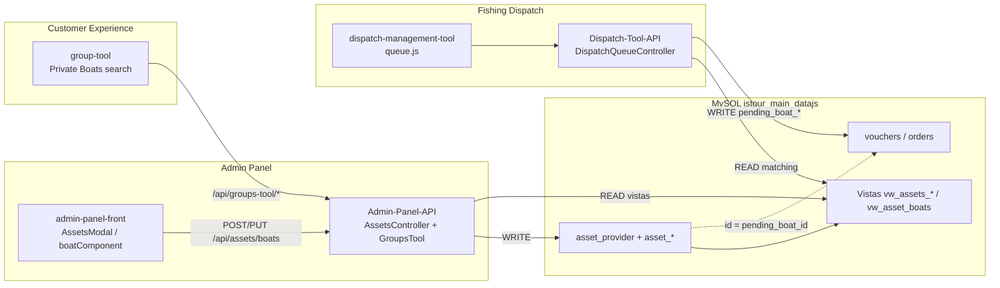
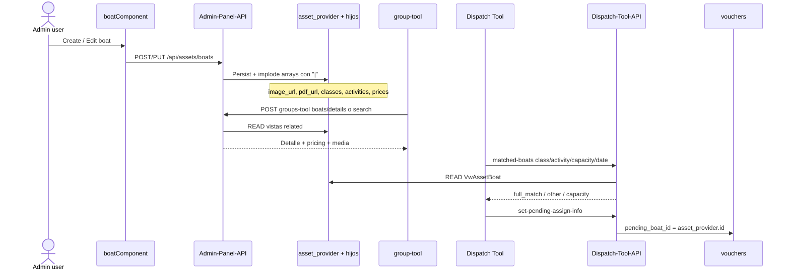
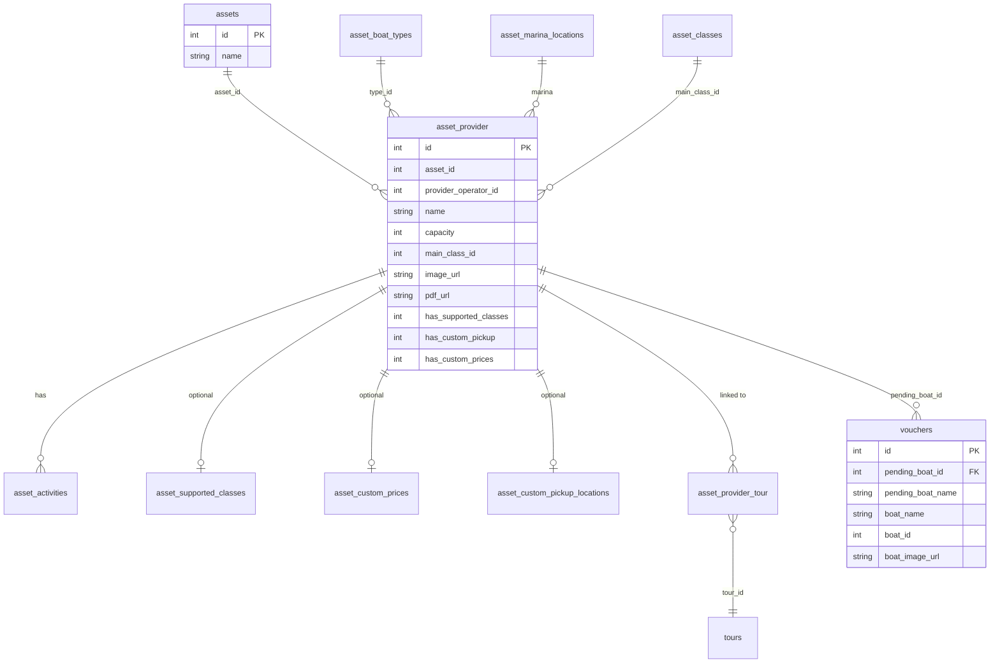
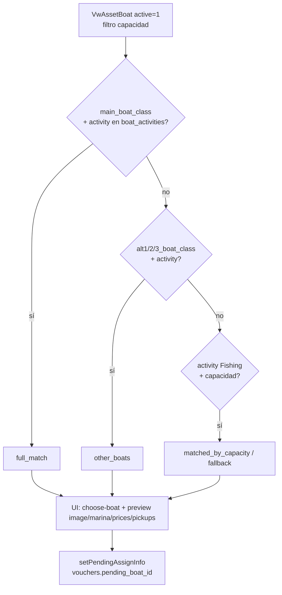
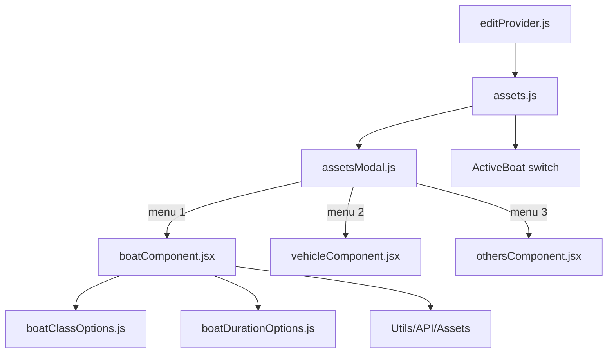

# Assets Modal — Boats (análisis para wiki)

Documentación del flujo de **assets tipo Boat** (`asset_id = 1`) desde Admin Panel hacia Group Tool (CE), Fishing Dispatch y la base `jstour_main_datajs`.

> Última actualización: 2026-07-23  
> Alcance: análisis previo (sin propuestas de cambio de código).

---

## Tabla de contenidos

- [Qué es](#qué-es)
- [Mapa de archivos (front)](#mapa-de-archivos-front)
- [Qué hace `boatComponent`](#qué-hace-boatcomponent)
- [Dependencias clave](#dependencias-clave)
- [Side effects](#side-effects)
- [Riesgos si se modifica](#riesgos-si-se-modifica)
- [Relación con el ecosistema](#relación-con-el-ecosistema)
- [Modelo de datos](#modelo-de-datos)
- [Diagramas](#diagramas)
- [IDs y constantes compartidas](#ids-y-constantes-compartidas)
- [Endpoints de referencia](#endpoints-de-referencia)
- [Repos relacionados](#repos-relacionados)

---

## Qué es

`AssetsModal` es el modal XL de **Providers → Edit Provider (operator)** para crear/editar:

| `menu` | Componente | `asset_id` / tipo |
|--------|------------|-------------------|
| 1 | `boatComponent.jsx` | `asset_id === 1` (Boats) |
| 2 | `vehicleComponent.jsx` | `assets.asset_type === "Vehicles"` |
| 3 | `othersComponent.jsx` | `assets.asset_type === "Others"` |

Solo se muestra si el provider tiene `is_operator === 1` (`editProvider.js` → `Assets`).

Los boats son **master data operativa y comercial**: los escribe Admin Panel; los leen Group Tool (CE / “Tool Chest”) y Dispatch (matching + asignación pendiente en vouchers).

---

## Mapa de archivos (front)

```
AssetsModal/
├── assetsModal.js              # Orquestador: menú de tipo + carga edit (getBoatEdit)
├── README.md                   # Este documento
├── constants/
│   ├── boatClassOptions.js     # Clases (Basic…Super Luxury) — IDs alineados a asset_classes
│   └── boatDurationOptions.js  # Duraciones + normalizeDurationValues
└── components/
    ├── boatComponent.jsx       # Formulario create/edit boat (~3k líneas)
    ├── vehicleComponent.jsx    # Vehículos (patrón más simple)
    └── othersComponent.jsx     # Others (patrón más simple)
```

Callers / API client:

| Archivo | Rol |
|---------|-----|
| `src/Pages/Providers/Utils/assets.js` | Tabs Boats/Vehicles/Others, open modal, delete, `resetTable` |
| `src/Pages/Providers/ProvidersCols.js` → `ActiveBoat` | Switch active (`changeActiveBoats`) |
| `src/Pages/Providers/editProvider.js` | Monta `<Assets />` si operator |
| `src/Utils/API/Assets/index.js` | Catálogos + `postBoat` / `putBoat` / `getBoatEdit` |

---

## Qué hace `boatComponent`

Formulario Formik + muchos `useState` para **crear o editar** un registro en `asset_provider` (boat) y tablas hijas.

### Al montar

1. Carga catálogos: boat types, locations, marinas, accessibility, activities (`groups-tool/load-filter`), departure locations.
2. Si `isEdit && dataEdit`: hidrata selects, flags, supported classes, custom pickup, custom prices, PDF/imagen.

### Al guardar (`onSubmit`)

Arma un payload con:

- Datos base (nombre, tipo, length/make/model, marina, capacidad, sailing/shade/AC, access, notes).
- `provider_operator_id` = `:id` de la ruta del provider (`useParams`).
- `asset_id: 1` fijo.
- `activities`, `main_class_id`, `pdf_url`, `image_url`.
- `has_supported_classes` + objeto `supported_classes` (hasta 3 clases × duration × departure).
- `has_custom_pickup` + `custom_pickup_locations` (hasta 3 filas).
- `has_custom_prices` + `custom_prices` (hasta 6 duration/net_price).
- `departure_locations` principales (se anulan si custom pickup está on y no hay flexible/supported classes).

Luego `POST /api/assets/boats` o `PUT /api/assets/boats/{id}`. Éxito → SweetAlert → cierra modal → `resetTable()`.

### UI condicional “fishing”

- Se muestra cuando **`boatTypeSelected === 3`** (`type_id` del boat type).
- Campos: Join Fleet, Last Inspected, Main Class, upload PDF/imagen (tooltips mencionan CE Tool Chest y Fishing Dispatch).

### Activities (multi-select) — origen de datos

No vienen de un endpoint de assets propio. Flujo:

1. `boatComponent` llama `getActivities({ search: "", tipo: "boats", list: "admin_cargarActivityCombo" })`.
2. Eso es `POST /api/groups-tool/load-filter` (`Utils/API/Assets` → Groups Tool).
3. `GroupsTool` rama `admin_cargarActivityCombo` lee **`charter_types_fishing`** (`CharterTypesFishing`), filtra nombres (`N/A`, `%Foot%`, `%Catamaran%`, `%Charter%`, `%Only%`) y devuelve `{ id, text }`.
4. El Select guarda IDs en `activitiesSelected` → payload `activities` → API boats → tabla **`asset_activities`** (`asset_provider_id` + `activity_id`).

**Mismo catálogo** que:

- Charter Type / activities de **precios Fishing** (`price_details` po 47 y `price_activities`).
- Combo del modal `PricingModals/fishing.js`.

**Distinto:** `boats_cargarActivityCombo` (Group Tool search) lee textos denormalizados de `VwAssetsRelatedProduct.charter_type`, no IDs.

Doc ampliada de productos/precios: [`../PricingModals/README.md`](../PricingModals/README.md).

### Departure locations filtrados por Location

Igual que Marina: las opciones de **todos** los multi-selects de departure (main, custom pickup 1–3, supported classes 1–3) se filtran con `item.location_id === locationSelected`. Al cambiar Location se limpian marina y las selecciones de departure.

### Uploads

Axios a `${API_URL}/media-library/upload` con `media_type_name`: `boat_asset_pdf` | `boat_asset_image`. El upload ocurre **antes** del submit; cancelar el modal no revierte el media.

---

## Dependencias clave

| Capa | Dependencia |
|------|-------------|
| UI | reactstrap, antd `Select`, Formik, SweetAlert2, lodash `map`, react-router `useParams` |
| Front API | `Utils/API/Assets`, `API_URL` + `imagesOptions` (upload) |
| Backend escritura | Admin-Panel-API `AssetsController` (`createBoat` / `updateBoat` / `showBoat`) |
| Backend lectura CE | Admin-Panel-API `GroupsTool` (`load-filter`, `quick-search`, `advanced-search`, `boats/details`) |
| Backend lectura Dispatch | Dispatch-Tool-API `VwAssetBoat`, `DispatchQueueController` |
| DB | `asset_provider` + tablas `asset_*`; vistas `vw_*`; runtime en `vouchers` / `orders` |

---

## Side effects

1. **Persistencia** en `asset_provider` y tablas hijas (activities, supported classes, custom pickup, custom prices).
2. **Media library**: PDF/imagen pueden quedar huérfanos si se cancela el form.
3. **Refresco** de la tabla de assets del provider.
4. En edit, `getBoatEdit` también decide el `menu` del modal (boat vs vehicle vs other).
5. Datos consumidos por **Group Tool** (búsqueda/detalle de boats) y **Dispatch** (matching por clase/actividad/capacidad; `pending_boat_id`).
6. Matching histórico en Dispatch también por **nombre** (`orders.boat_name` ↔ `asset_name`), no solo por FK.

---

## Riesgos si se modifica

- Contrato frágil con el API: shapes anidados y flags `0/1`. Arrays en front → `implode('|', …)` en backend.
- Estado duplicado (Formik + muchos `useState` + pares `initial*` / selected*): fácil romper edit o enviar valores viejos.
- Interacción **custom pickup ↔ supported classes ↔ departure_locations**.
- Sin `validationSchema` Yup activo: validación casi solo server-side.
- `asset_id: 1` y `provider_operator_id` mal puestos asocian el boat al operator equivocado.
- Cambiar IDs de clase/duración/actividades desalinea Admin UI, vistas SQL, Group Tool y Dispatch.
- Cambios en `image_url` / `pdf_url` / capacity / classes impactan preview WA y matching en Dispatch.

---

## Relación con el ecosistema

### Quién escribe / quién lee

| Sistema | Rol respecto a boats |
|---------|----------------------|
| **admin-panel-front** + **Admin-Panel-API** | **Escritor** de master data (`asset_provider` + hijos). También asigna boat↔tour (`asset_provider_tour`). |
| **group-tool** (CE) | **Lector** vía `/api/groups-tool/*` (vistas `vw_assets_related_*`). Muestra precios, imagen, PDF, other boats. |
| **dispatch-management-tool** + **Dispatch-Tool-API** | **Lector** de catálogo/matching (`VwAssetBoat`). **Escritor** de asignación pendiente en `vouchers` (`pending_boat_id` = `asset_provider.id`). |
| **Database** (`jstour_main_datajs`) | Fuente de verdad SQL: tablas asset (deducidas de modelos; dump incompleto en repo), `vouchers`, `orders`, SPs de cola. |

### Dominios

1. **Master data** — fila boat + hijos, mantenida en Provider → Assets.
2. **Commercial link** — `asset_provider_tour` / product views → pricing en Group Tool.
3. **Dispatch ops** — matching → `vouchers.pending_boat_*` → confirmación (puede rellenar `boat_*` confirmados).
4. **Voucher boat_locations** — locations de voucher/operator; paralelo al marina del asset (no es la misma tabla).

---

## Modelo de datos

### Tablas / modelos núcleo (Admin-Panel-API)

| Tabla | Modelo | Notas |
|-------|--------|-------|
| `asset_provider` | `AssetProvider` | Boat cuando `asset_id = 1` |
| `assets` | `Asset` | Catálogo; Boat = id **1** |
| `asset_boat_types` | `AssetBoatType` | `type_id` |
| `asset_marina_locations` | `AssetMarinaLocation` | Marina |
| `asset_departure_locations` | `AssetDepartureLocation` | IDs en strings pipe-separated |
| `asset_accesabilities` | `AssetAccesability` | Accesibilidad |
| `asset_activities` | `AssetActivity` | `asset_provider_id` + `activity_id` |
| `asset_supported_classes` | `AssetSupportedClass` | `class_id_1..3`, durations, departures |
| `asset_custom_prices` | `AssetCustomPrice` | `duration_1..6`, `net_price_1..6` |
| `asset_custom_pickup_locations` | `AssetCustomPickupLocation` | Pickup custom |
| `asset_provider_tour` | `AssetProviderTour` | Link boat↔tour |
| `asset_classes` | (sin Eloquent hallado) | Usada en SPs / matching |

### Vistas de lectura

| Vista / modelo | Consumidor |
|----------------|------------|
| `vw_assets_related_tours` / `VwAssetsRelatedTour` | Group Tool search |
| `vw_assets_related_products` / `VwAssetsRelatedProduct` | Group Tool pricing/attrs |
| `vw_asset_boats` / `VwAssetBoat` | Dispatch matching |

### Runtime operativo (`Database/.../vouchers.sql`)

Columnas relevantes en `vouchers`:

- `pending_boat_id`, `pending_boat_name` — asignación pendiente (Dispatch)
- `boat_id`, `boat_name`, `boat_class` — confirmados
- `boat_image_url`, `boat_location*`, `boat_google_maps_url`, `boat_date`

**Gap wiki:** el repo `Database` incluye `vouchers` y SPs, pero no siempre dumps `CREATE TABLE` de `asset_provider` / vistas asset; el esquema se completa con modelos Eloquent.

---

## Diagramas

### 1. Ecosistema (quién habla con quién)



### 2. Flujo de escritura → consumo



### 3. Grafo de entidades (ER simplificado)



### 4. Matching en Dispatch (lectura de campos del boat)



### 5. Árbol de componentes UI (Admin)



---

## IDs y constantes compartidas

| Constante | Valor | Dónde |
|-----------|-------|-------|
| Tipo asset Boat | `asset_id = 1` | front, Dispatch catalogs, modelos |
| Tour types búsqueda boats (CE) | `[2, 5, 6]` | `GroupsTool` |
| Boat type que muestra fishing fields | `type_id === 3` | `boatComponent.jsx` |
| Clases UI | 1 Economy … 10 Basic | `boatClassOptions.js` ≈ `asset_classes` |
| Duraciones | `"4 Hours"` … `"All Trips"` | `boatDurationOptions.js` |
| Operators excluidos lista boats | `381`, `391` | Dispatch-Tool-API catalogs |
| Media types | `boat_asset_pdf`, `boat_asset_image` | upload form |
| Activity fallback Dispatch | string `"Fishing"` en `boat_activities` | `DispatchQueueController` |
| ID compartido principal | `asset_provider.id` | = `pending_boat_id` / `asset_provider_id` en APIs |

Alias a tener en cuenta en payloads/lectura:

- `has_custom_pickup` / `has_custom_pick_up`
- `custom_pickup_locations` / `custom_pick_up_locations`

---

## Endpoints de referencia

### Escritura / catálogo (Admin-Panel-API, sanctum)

| Método | Ruta | Handler |
|--------|------|---------|
| POST | `/api/assets/boats` | `createBoat` |
| PUT | `/api/assets/boats/{id}` | `updateBoat` |
| GET | `/api/assets/boats/{id}` | `showBoat` |
| GET | `/api/assets/provider/{providerId}` | assets del provider |
| GET | `/api/assets/boat-types`, `marina-locations`, `departure-locations`, `accesability` | catálogos |
| PUT | `/api/assets/change/{id}/status` | active |
| DELETE | `/api/assets/{id}` | delete |
| * | `/api/asset-provider-tour/*` | assign boat↔tour |
| POST | `/api/media-library/upload` | PDF/imagen |

### Lectura CE (público groups-tool)

| Método | Ruta | Uso |
|--------|------|-----|
| POST | `/api/groups-tool/load-filter` | Combos (`boats_cargar*`, también activities del admin form) |
| POST | `/api/groups-tool/quick-search` / `advanced-search` | Búsqueda boats |
| POST | `/api/groups-tool/boats/details` | Detalle + pricing + media |

### Dispatch-Tool-API

| Método | Ruta | Uso |
|--------|------|-----|
| GET | `/dispatch-queue/matched-boats/{class}/{activity}/{capacity}/{date}` | Matching |
| GET | `/dispatch-queue/boat-details/{boat_id}/{date}` | Detalle |
| POST | `/dispatch-queue/set-pending-assign-info/{id}` | Asigna `pending_boat_*` |
| POST | `/dispatch-queue/unset-pending-assign-info/{id}` | Limpia pending |
| GET | `/boats/{hash}` | Boats del operator |
| POST | `/catalogs/boats-list/{name?}` | Autocomplete |

---

## Repos relacionados

| Repo / path | Relación |
|-------------|----------|
| `admin-panel-front` | UI de escritura (este modal) |
| `Admin-Panel-API` | Persistencia assets + Groups Tool API |
| `jstourandtravel/cetools/group-tool` | UI CE “Private Boats”; consume groups-tool |
| `dispatch-management-tool` | UI cola; `loadBoatsForOrder` / `loadBoatInfo` en `js/queue.js` |
| `Dispatch-Tool-API` | Matching `VwAssetBoat` + write vouchers |
| `Database/Database/jstour_main_datajs` | Schema/dumps (`vouchers.sql`, SPs); tablas asset a menudo solo vía modelos |

Ver también hub wiki: `Admin-Panel-API/config/tools_wiki.php` (entradas `dispatch-management-tool`, `dispatch-tool-api`, cetools).

---

## Notas para la wiki

- El término **“CE Tool Chest”** en tooltips del form apunta al uso de PDF/imagen/notas en herramientas CE; el catálogo de boats en este workspace es **group-tool** (`/api/groups-tool/*`). La ruta `/api/ce-toolchest/*` del Admin-Panel-API es otro flujo (Search-by-Date), no este CRUD.
- **Fuente de verdad del catálogo boat** = Admin Panel. Dispatch y Group Tool no deberían crear `asset_provider` de tipo boat.
- Al documentar cambios futuros, actualizar este README y, si aplica, hints en `tools_wiki.php` / docs del API.
