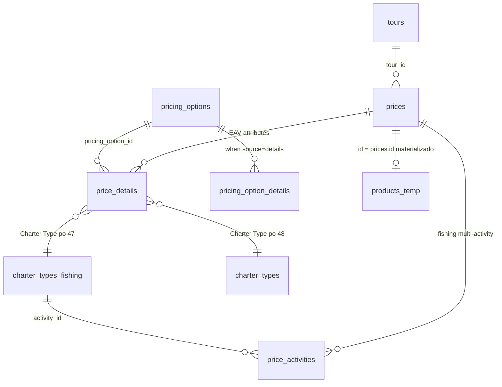
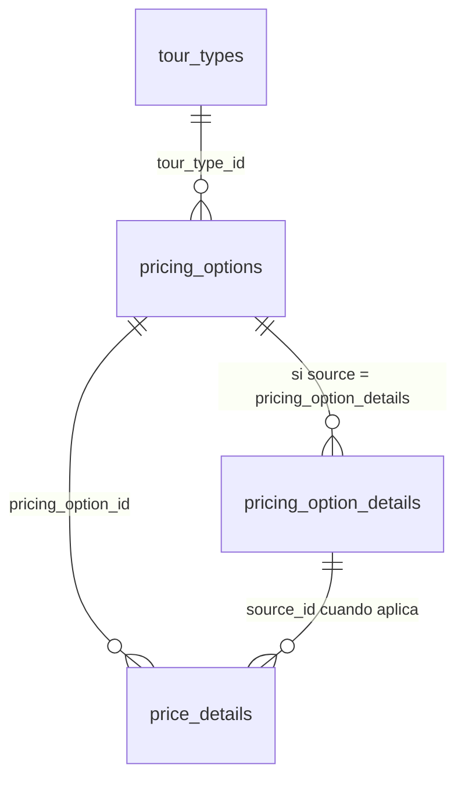
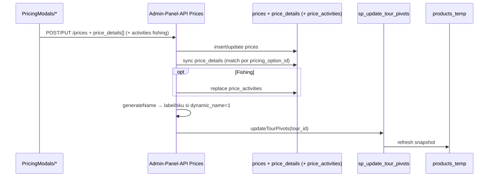
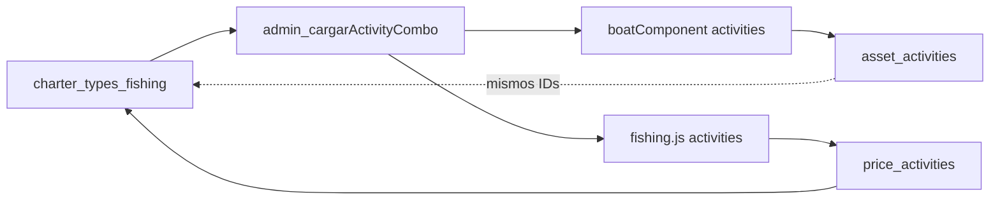
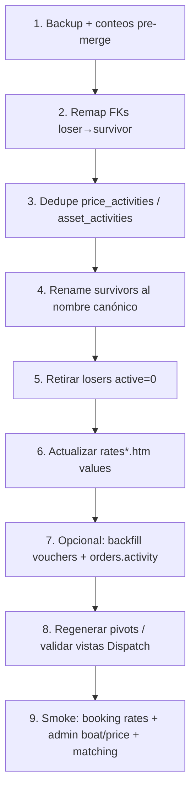

# Pricing / Products — características y persistencia (wiki)

Documentación de cómo el Admin Panel guarda **precios (variantes / “products”)** y qué **características** lleva cada uno, con foco en Fishing y el vínculo con activities de boats.

> Fecha: 2026-07-23 · Solo análisis documentado (sin propuestas de cambio).

---

## Glosario (importante)

| Término en UI / código | Realidad en BD |
|------------------------|----------------|
| **Product** (modal “Add Product”) | Fila en `prices` (variante vendible de un tour). En booking runtime, la misma fila se proyecta en `products_temp` (`id` = `prices.id`). |
| **Price** | Misma entidad: tabla `prices`. |
| **Price Option** | **No es una tabla.** Es un *atributo* del sistema EAV: definición en `pricing_options` (`name = 'Price Option'`), valores en `pricing_option_details` (u otra tabla vía `source`), asignación en `price_details.source_id`. La columna denormalizada `products_temp.price_option` es el **nombre** elegido. |
| **`pricing_options`** | Catálogo de atributos por `tour_type_id` (qué campos tiene un product). Ver [Tablas pricing_option*](#tablas-pricing_option-catálogo-eav). |
| **`pricing_option_details`** | Valores tipados cuando `source = pricing_option_details` (Adults, 4 Hours, Per Person…). |
| **products_temp** | Snapshot denormalizado para booking/export. Se regenera con `sp_update_tour_pivots`. No editar a mano. |
| **products_temp_** | Definición SQL (VIEW) de cómo se aplanan las características desde `prices` + `price_details`. |
| **Charter Type (Fishing)** | Catálogo `charter_types_fishing`. |
| **Charter Type (Private Charter)** | Catálogo `charter_types` (tabla distinta). |
| **Activities (boat / fishing price)** | Mismos IDs de `charter_types_fishing`, guardados en `asset_activities` o `price_activities`. |

---

## Modelo de datos



### Tablas núcleo

| Tabla | Rol |
|-------|-----|
| `prices` | Variante: montos, qty, sku, label, flags, price sheet `p_*`/`t_*` |
| `price_details` | EAV: `price_id`, `pricing_option_id`, `source_id`, `min`, `max`, `label` |
| `price_activities` | Solo fishing multi: `price_id` + `activity_id` → FK `charter_types_fishing` |
| `pricing_options` | Catálogo de atributos por `tour_type_id` + `source` (tabla origen) |
| `pricing_option_details` | Valores tipados cuando `source = pricing_option_details` |
| `products_temp` | Denormalizado (booking) |
| `charter_types` | Charter types Private Charter (type 6) |
| `charter_types_fishing` | Charter types Fishing (type 5) **y** activities de boats/precios |

`source_id` en `price_details` es **polimórfico**: apunta a la tabla indicada en `pricing_options.source` (no hay FK única).

---

## Tablas `pricing_option*` (catálogo EAV)

Solo existen **dos** tablas con ese prefijo. No confundir con `price_details` (asignación del valor elegido a un `prices.id`).



### `pricing_options` — definición del atributo

Catálogo de **qué características existen** por tipo de tour.

| Columna | Tipo / notas | Rol |
|---------|--------------|-----|
| `id` | PK | ID hardcodeado en modales front (`33`, `47`, …) y en `price_details.pricing_option_id` |
| `tour_type_id` | FK → `tour_types` | Ámbito del atributo. Unique compuesto con `name` |
| `name` | varchar(100) | Nombre interno (`Price Type`, `Price Option`, `Duration`, `Charter Type`…). La vista `products_temp_` hace JOIN por este **literal** |
| `source` | varchar(255) | De dónde salen los valores del dropdown (ver abajo) |
| `order` | int | Orden al armar el nombre dinámico del producto |
| `active` | tinyint | 0/1 |
| `created_at` / `updated_at` / `deleted_at` | datetime | Auditoría / soft delete |

**Unique:** `(tour_type_id, name)`.

#### Formato de `source`

Parseado en `CommonFunctions::getSourceElements` y usado por `GET /pricingOptions/{id}/items`:

| Valor de `source` | Significado |
|-------------------|-------------|
| `pricing_option_details` | Los valores viven en la tabla hija `pricing_option_details` (filtrados por `pricing_option_id`) |
| `tabla\|id,name` | Valores en otra tabla; columnas id/texto |
| `tabla\|id,name\|0\|1` | Igual + flags extra en el string (p. ej. filtro active); el parser usa piezas `explode('\|')` |

Ejemplos reales:

| id | tour_type | name | source |
|----|-----------|------|--------|
| 33 | 5 Fishing | Price Type | `pricing_option_details` |
| 34 | 5 | Price Option | `pricing_option_details` |
| 35 | 5 | Duration | `pricing_option_details` |
| 36 | 5 | Collect | `collects\|id,name\|0\|1` |
| 37 | 5 | Location | `locations\|id,name` |
| 47 | 5 | Charter Type | `charter_types_fishing\|id,name` |
| 48 | 6 Private Charter | Charter Type | `charter_types\|id,name` |
| 4 | 1 Tour | Collect | `collects\|id,name\|0\|1` |
| 50 | 3 Airport | Zone | `zones\|id,name\|0\|1` |

Inventario completo por tipo: ver sección [Características por tipo de tour](#características-por-tipo-de-tour-tour_typesid) y dump `Database/.../pricing_options.sql`.

#### Cómo el front carga un combo

```text
getPricingOptionsAPI(pricing_option_id)
  → GET /api/pricingOptions/{id}/items
  → PricingOptions::itemsPerPricingOption
  → lee pricing_options.source
  → si source = pricing_option_details → Pricingoptiondetail (id, name AS text, apply_range, …)
  → si no → query dinámica a la tabla del source (collects, seasons, locations, …)
```

También: `GET /tourtypes/{tour_type_id}/pricingOptions`, resource CRUD `pricingOptions`, y `GET /pricingOptions/addons/{id}/items` para add-ons.

Modelos: `App\Models\Pricingoption`, `App\Models\Pricingoptiondetail`.  
Controller: `App\Http\Controllers\PricingOptions`.

---

### `pricing_option_details` — valores tipados del atributo

Solo aplica cuando el padre tiene `source = 'pricing_option_details'`.  
Si el `source` apunta a `collects` / `seasons` / `charter_types*`, **esta tabla no interviene** para ese atributo.

| Columna | Rol |
|---------|-----|
| `id` | PK = valor que se guarda en `price_details.source_id` |
| `pricing_option_id` | FK → `pricing_options` (**ON DELETE CASCADE**) |
| `name` | Texto del dropdown (Adults, 4 Hours, Per Person, One-Way…) |
| `apply_range` | `1` = el form pide min/max (pax) en ese detail |
| `display_in_name` | `1` = participa en el nombre dinámico del producto (`generateName`) |
| `singular_name` | Booking form (“Adult”, “Child”, “Boat”…) → también se proyecta a `products_temp.singular_name` |
| `sku_code` | Caracter(es) finales del SKU (`A`, `K`, `4`, `Z`…) |
| `transfer_code` | Código SKU transfers (p. ej. Arrival/Departure) |
| `transfer_type_code` | Código SKU tipo transfer (One-Way `O`, Round-Trip `R`) |
| `add_on_type` | `1` add-on / `2` upgrade (sobre todo tour type 7) |
| `position_display` | Orden en booking form / `products_temp.position_display` |
| `active` | 0/1 |
| `created_at` / `updated_at` / `deleted_at` | Auditoría |

#### Ejemplos fishing (tour type 5)

| pricing_option_id | name atributo | Ejemplos de details |
|-------------------|---------------|---------------------|
| 33 | Price Type | Per Item, Per Person |
| 34 | Price Option | Boats (`apply_range` puede pedir min/max) |
| 35 | Duration | 4 Hours, 6 Hours, 7 Hours, 8 Hours (`sku_code` 4/6/7/8, `display_in_name`) |

Otros tipos: Adults/Kids/Infants (Price Option tours), Vehicle types (airport), One-Way/Round-Trip (transport), Fixed (private charter price type), etc. Dump: `pricing_option_details.sql`.

#### Relación con `price_details` (no es `pricing_option*`)

Al guardar un product/price:

```json
{
  "pricing_option_id": 35,
  "source_id": 86,
  "min": 1,
  "max": 6,
  "label": null
}
```

- `pricing_option_id` → fila en **`pricing_options`** (Duration fishing).
- `source_id` → fila en **`pricing_option_details`** (p. ej. id 86 = “4 Hours”) **o** id en collects/locations/charter_types* según `source`.
- `min`/`max` → usados cuando `apply_range` o cuando Duration/Vehicle concentran pax.

---

### Inventario de `pricing_options` (IDs estables)

| id | tour_type_id | name | source (resumen) |
|----|--------------|------|------------------|
| 1 | 1 Tour | Price Type | details |
| 2 | 1 | Price Option | details |
| 4 | 1 | Collect | collects |
| 28 | 1 | Season | seasons |
| 63 | 1 | Price Option 2 | details |
| 62 | 1 | Price Type Fees | details |
| 6 | 2 Private Tour | Price Type | details |
| 7 | 2 | Price Option | details |
| 9 | 2 | Collect | collects |
| 29 | 2 | Season | seasons |
| 64 | 2 | Price Option 2 | details |
| 10 | 3 Airport | Price Type | details |
| 11 | 3 | Price Option | details |
| 12 | 3 | Transfer Type | details |
| 13 | 3 | Direction | details |
| 14 | 3 | Collect | collects |
| 17 | 3 | Vehicle | details |
| 30 | 3 | Season | seasons |
| 50 | 3 | Zone | zones |
| 65 | 3 | Price Option 2 | details |
| 20 | 4 Transport | Price Type | details |
| 21 | 4 | Price Option | details |
| 22 | 4 | Collect | collects |
| 24 | 4 | Vehicle | details |
| 31 | 4 | Season | seasons |
| 46 | 4 | Transfer Type | details |
| 49 | 4 | Direction | details |
| 51 | 4 | Zone | zones |
| 66 | 4 | Price Option 2 | details |
| 69 | 4 | Arrival Zone | zones |
| 32 | 5 Fishing | Season | seasons |
| 33 | 5 | Price Type | details |
| 34 | 5 | Price Option | details |
| 35 | 5 | Duration | details |
| 36 | 5 | Collect | collects |
| 37 | 5 | Location | locations |
| 47 | 5 | Charter Type | charter_types_fishing |
| 67 | 5 | Price Option 2 | details *(catálogo; fishing.js no lo envía)* |
| 38 | 6 Private Charter | Price Type | details |
| 39 | 6 | Price Option | details |
| 40 | 6 | Duration | details |
| 41 | 6 | Collect | collects |
| 42 | 6 | Location | locations |
| 44 | 6 | Season | seasons |
| 48 | 6 | Charter Type | charter_types |
| 68 | 6 | Price Option 2 | details |
| 52–60 | 7 Add-ons | Match Quantity, Price Type, Collect, Add-On*, … | mixto |

---

### Dependencias y side effects (`pricing_option*`)

| Dependiente | Cómo usa estas tablas |
|-------------|----------------------|
| `price_details` | Guarda `pricing_option_id` + `source_id` |
| `products_temp_` / SP pivots | JOINs por `pricing_options.name`; columnas aplanadas desde details u otras tablas |
| `generateName` / SKU | `display_in_name`, `name`, `sku_code`, `transfer_*_code` |
| Booking forms | `singular_name`, `position_display`, min/max |
| Modales PricingModals + `pricing.js` | IDs fijos de `pricing_options.id` |
| Add-ons modal | Options 52–60 vía `getPricingOptionsAPI` |
| Vouchers | p. ej. details de option 62 (Price Type Fees) |

### Riesgos si se modifica

| Cambio | Impacto |
|--------|---------|
| Cambiar / reusar `pricing_options.id` | Rompe front hardcodeado y filas `price_details` existentes |
| Renombrar `pricing_options.name` | Rompe vista `products_temp_` y lógica que busca por literal |
| Borrar un `pricing_option_details` en uso | `source_id` huérfano; booking/nombre/SKU incorrectos |
| DELETE del padre `pricing_options` | CASCADE borra todos los details hijos |
| Cambiar `source` de un option | Combos y `source_id` dejan de apuntar a la tabla correcta |
| Mass-assignment API | `Pricingoptiondetail::$fillable` **no** incluye `apply_range`, `sku_code`, `singular_name`, `transfer_*`; create vía API puede no persistir esos campos si solo usa `create`/`createMany` con fillable |

### Schema dumps

- `Database/Database/jstour_main_datajs/pricing_options.sql`
- `Database/Database/jstour_main_datajs/pricing_option_details.sql`

---

## Flujo de guardado



**Endpoints:** `POST /prices`, `PUT /prices/{id}`, `GET /prices/{id}`, `GET /tours/{tour_id}/prices`, status/bulk/delete.

**Front API:** `postPricesAPI` / `updatePriceAPI` en `Utils/API/Tours/index.js`.  
**Orquestación:** `Pages/Tours/EditComponents/pricing.js`.

---

## Características por tipo de tour (`tour_types.id`)

Cada característica = una fila en `price_details` con el `pricing_option_id` indicado.

| Característica | Tour (1) | Private Tour (2) | Airport (3) | Transport (4) | Fishing (5) | Private Charter (6) |
|----------------|:--------:|:----------------:|:-----------:|:-------------:|:-----------:|:-------------------:|
| Price Type | 1 | 6 | 10 | 20 | **33** | 38 |
| Price Option | 2 | 7 | 11 | 21 | **34** | 39 |
| Price Option 2 | 63 | 64 | 65* | 66* | 67* (catálogo; **fishing.js no lo envía**) | 68 |
| Collect | 4 | 9 | 14 | 22 | **36** | 41 |
| Season | 28 | 29 | 30 | 31 | **32** | 44 |
| Duration (+ min/max pax en el detail) | — | — | — | — | **35** | 40 |
| Location (EAV → `locations`) | — | — | — | — | **37** | 42 |
| Charter Type | — | — | — | — | **47 → `charter_types_fishing`** | **48 → `charter_types`** |
| Transfer Type / Direction / Vehicle / Zone | — | — | 12,13,17,50 | 46,49,24,51 + Arrival Zone 69 | — | — |
| **activities[]** → `price_activities` | — | — | — | — | **sí** | — |
| Asset attrs (budget/vibe/meals…) | — | — | — | — | parcial | `asset_provider_product` |
| Price sheet `p_*` / `t_*` | básico | básico | básico | básico | completo | completo |
| `min_qty` / `max_qty` | columna `prices` | igual | igual | igual | igual | igual |

\* Existe en `pricing_options`; no todos los modales lo mandan.

### Fuente de cada atributo (`pricing_options.source`)

| Name | Source típico |
|------|----------------|
| Price Type / Price Option / Price Option 2 / Duration / Transfer Type / Direction / Vehicle | `pricing_option_details` |
| Collect | `collects` |
| Season | `seasons` |
| Location | `locations` |
| Zone / Arrival Zone | `zones` |
| Charter Type (5) | `charter_types_fishing` |
| Charter Type (6) | `charter_types` |

---

## Fishing en detalle (`fishing.js` → tour type 5)

### Payload de características

```text
price_details:
  33 Price Type     → pricing_option_details.id
  34 Price Option   → pricing_option_details.id
  36 Collect        → collects.id
  32 Season         → seasons.id
  47 Charter Type   → charter_types_fishing.id   ← UN valor “oficial” (nombre/SKU)
  35 Duration       → pricing_option_details.id + min/max pax
  37 Location       → locations.id

activities: [id, id, …]  → price_activities.activity_id → charter_types_fishing.id
```

### Doble uso de `charter_types_fishing`

| Uso | Dónde | Cardinalidad | Para qué |
|-----|-------|--------------|----------|
| **Charter Type** del producto | `price_details` po **47** | 1 | Nombre dinámico, `products_temp.charter_type`, matching comercial |
| **Activities** del producto | `price_activities` | N | Multi-actividad del precio fishing |
| **Activities del barco** | `asset_activities` | N | Capacidades del asset (mismo catálogo / mismos IDs) |

El combo de activities (barco **y** modal fishing) usa `POST /groups-tool/load-filter` con `list: "admin_cargarActivityCombo"` → lee `CharterTypesFishing` filtrando nombres con Foot / Catamaran / Charter / Only / N/A.

### Modal front

`PricingModals/fishing.js` — Formik + IDs hardcodeados de `pricing_option_id` + `activitiesSelected`.

Helpers de cálculo: `tourPricingCalculations.js` (IVA 16%, gratuity, sheets). No persisten solos.

---

## Private Charter vs Fishing (charter catalogs)

| | Fishing (5) | Private Charter (6) |
|--|-------------|---------------------|
| Tabla charter | `charter_types_fishing` | `charter_types` |
| pricing_option Charter Type | 47 | 48 |
| Activities multi | sí (`price_activities`) | no |
| Ejemplos catálogo | Deep Sea, Bottom, Fly Fishing, Inshore… | Sunset Cruise, Yacht Charter, Catamaran packages… |

**No intercambiar IDs entre tablas:** los IDs no son el mismo dominio aunque algunos nombres se parezcan.

---

## Modales → qué escriben

| Archivo | Tour type | Características (`pricing_option_id`) |
|---------|-----------|----------------------------------------|
| `addNewProduct.js` | 1 | 1, 2, 4, 28, 63 |
| `addNewPrivateTour.js` | 2 | 6, 7, 9, 29, 64 |
| `addNewAirportTransfer.js` | 3 | 10, 11, 14, 30, 12, 13, 17, 50 |
| `addNewTransportation.js` | 4 | 20, 21, 22, 31, 46, 49, 24, 51, 69 |
| `fishing.js` | 5 | 33, 34, 36, 32, 47, 35, 37 + `activities` |
| `addNewPrivateCharter.js` | 6 | 38, 39, 41, 44, 48, 40, 42, 68 + asset attrs |
| `addPezGato.js` | fishing-like | similar a fishing |
| `relatedModal.js` | — | **no** guarda precios |
| `addons.js` / Addon* | add-ons | tabla `add_ons`, no `prices` |

---

## `products_temp` / `products_temp_` — características aplanadas

Columnas de negocio relevantes en el snapshot:

- Contexto: `website`, `provider`, `operator`, `category`, `location`, `tour_id`, `type`, `sku`, `product` (label)
- Características: `price_type`, `price_option`, `price_option2`, `duration`, `collect`, `seasons`, `charter_type`, `transfer_type`, `direction`, `vehicle`, `zone`/`zone_name`
- Pax: `min_pax` / `max_pax` (desde Price Option **o** Vehicle **o** Duration detail)
- Booking qty: `min_qty` / `max_qty`
- Montos: `public`, `deposit`, `price`, `rate`, `commision`, `net_price`, `ship_price`, `compare_at`, sheets…

La vista resuelve `charter_type` con `charter_types` **o** `charter_types_fishing` según `tour_types`.

---

## Side effects al guardar un price

1. Insert/update `prices`
2. Sync `price_details` (update matchea por `pricing_option_id`; **no borra** details de options no enviadas)
3. Si vienen `activities`: replace en `price_activities`
4. `generateName` puede reescribir `label`/`sku`
5. Opcional `asset_provider_product` si hay `budget_id`
6. `CALL sp_update_tour_pivots(tour_id)` → refresca pivots / `products_temp` (impacto booking forms)

---

## Riesgos

- Hardcode de `pricing_option_id` en modales: romper create/update y nombres.
- Renombrar `pricing_options.name`: rompe joins de `products_temp_` (usan el literal `'Price Option'`, `'Charter Type'`, …).
- Cambiar IDs/nombres en `charter_types_fishing`: rompe prices, boats activities, Groups Tool, Dispatch matching por activity.
- Confundir `charter_types` vs `charter_types_fishing`.
- Editar `products_temp` a mano: se pierde en el próximo SP.
- Soft-delete de price con orders: bloqueado; usar deactivate.

---

## Vínculo con boats (activities)

Ver también: [`../AssetsModal/README.md`](../AssetsModal/README.md) (sección Activities).



---

## Archivos clave

| Path | Rol |
|------|-----|
| `PricingModals/fishing.js` | Create/edit fishing product |
| `PricingModals/addNew*.js` | Otros tipos |
| `PricingModals/tourPricingCalculations.js` | Cálculos sheet |
| `Utils/API/Tours/index.js` | HTTP prices |
| `Admin-Panel-API` `PricingOptions` + `Pricingoption` / `Pricingoptiondetail` | Catálogo EAV `pricing_options` / `pricing_option_details` |
| `Admin-Panel-API` `Prices` controller | Persistencia |
| `Models/CharterTypesFishing.php` | Tabla `charter_types_fishing` |
| `Models/CharterType.php` | Tabla `charter_types` |
| `Database/.../prices.sql`, `price_details.sql`, `price_activities.sql`, `pricing_options.sql`, `pricing_option_details.sql`, `products_temp*.sql`, `charter_types*.sql` | Schema |

---

## Playbook: unificar / merge de `charter_types_fishing`

Objetivo de negocio (nombres canónicos):

| Canon | Origen(es) actuales | Acción |
|-------|---------------------|--------|
| Deep Sea & Bottom Fishing | id **3** `Bottom and Deep Sea Combo` | Solo **rename** |
| Deep Sea Fishing & Snorkeling | id **54** `Deep Sea and Snorkeling Combo` + id **16** `Deep Sea & Snorkeling` | **Merge** → survivor **54**, retirar **16** |
| Bottom Fishing & Snorkeling | id **4** `Bottom and Snorkeling Combo` + id **53** `Bottom & Snorkeling` | **Merge** → survivor **4**, retirar **53** |
| Deep Sea, Bottom & Snorkeling | id **5** `Try All Three Combo` | Solo **rename** |

> Survivors elegidos: IDs más usados en `rates.htm` / vouchers (`3`, `4`, `54`, `5`). Los “cortos” (`16`, `53`) son los que se absorben.

### Por qué merge (no solo rename)

Hay **dos IDs** para el mismo concepto. Si solo renombras ambos a igual texto, el combo admin mostraría duplicados y FKs seguirían fragmentadas. Merge = un id canónico + remapeo de FKs + soft-retire del perdedor.

### Tablas / superficies a tocar

| Superficie | Tipo | Qué hacer |
|------------|------|-----------|
| `charter_types_fishing` | catálogo | UPDATE `name` del survivor; `active=0` (o soft-delete) del loser |
| `price_activities.activity_id` | FK id | Remap loser → survivor; dedupe unique (price_id, activity_id) |
| `asset_activities.activity_id` | FK id | Igual que arriba |
| `price_details` donde `pricing_option_id = 47` y `source_id` = loser | FK lógica | Remap a survivor (pocas/filas nulas esperadas para estos ids) |
| Vistas `vw_asset_boats` / related | nombres | Se regeneran o leen el catálogo; validar post-merge |
| Dispatch matching | **string** en `boat_activities` (pipe) | Tras remap de boats, activities deben mostrar el **nuevo nombre** |
| `rates.htm` / `rates-pdc.htm` (+ Cabo/Cancun rates) | **string quemado** | Cambiar `option value` (y label) al nombre canónico |
| `vouchers.activity` | string histórico | Opcional backfill; no bloquea merge |
| `orders.activity` (`jstour_orders_A2`) | string histórico | Opcional backfill (mismo script 03); reportes/colas |
| `products_temp` | denormalizado | Solo si algún price usa po47 con esos ids; luego `sp_update_tour_pivots` |
| Group Tool / admin combos | lectura | Automático al cambiar catálogo (filtrar `active`) |

`price_activities` tiene FK `ON UPDATE CASCADE` / `ON DELETE CASCADE` a `charter_types_fishing`. **No borrar** el loser hasta remapejar; preferir `active=0` y no CASCADE-delete.

### SQL listo para ejecutar a mano

Scripts versionados (conteos → merge → vouchers opcional → validación):

`Database/Database/jstour_main_datajs/scripts/charter_types_fishing_unify/`

Ver el `README.md` de esa carpeta (orden, checklist HTM, mapa canónico).

### Orden de ejecución (producción)



### SQL plantilla (por cada par merge)

Ejemplo: absorber **16 → 54** (Deep Sea Fishing & Snorkeling):

```sql
-- 0) Conteos
SELECT 'price_activities' t, activity_id, COUNT(*) c FROM price_activities WHERE activity_id IN (16,54) GROUP BY activity_id
UNION ALL
SELECT 'asset_activities', activity_id, COUNT(*) FROM asset_activities WHERE activity_id IN (16,54) GROUP BY activity_id
UNION ALL
SELECT 'price_details_po47', source_id, COUNT(*) FROM price_details WHERE pricing_option_id=47 AND source_id IN (16,54) GROUP BY source_id;

-- 1) Remap evitando duplicar (price_id, activity_id)
UPDATE price_activities pa
JOIN price_activities exist ON exist.price_id = pa.price_id AND exist.activity_id = 54
SET pa.activity_id = 54  -- no-op intent; better delete losers that already have survivor:
WHERE pa.activity_id = 16;

DELETE pa FROM price_activities pa
INNER JOIN price_activities keep
  ON keep.price_id = pa.price_id AND keep.activity_id = 54
WHERE pa.activity_id = 16;

UPDATE price_activities SET activity_id = 54 WHERE activity_id = 16;

-- mismo patrón en asset_activities
DELETE aa FROM asset_activities aa
INNER JOIN asset_activities keep
  ON keep.asset_provider_id = aa.asset_provider_id AND keep.activity_id = 54
WHERE aa.activity_id = 16;

UPDATE asset_activities SET activity_id = 54 WHERE activity_id = 16;

UPDATE price_details
SET source_id = 54
WHERE pricing_option_id = 47 AND source_id = 16;

-- 2) Nombre canónico + retirar loser
UPDATE charter_types_fishing SET name = 'Deep Sea Fishing & Snorkeling', updated_at = NOW() WHERE id = 54;
UPDATE charter_types_fishing SET active = 0, updated_at = NOW() WHERE id = 16;
```

Repetir para **53 → 4** con nombre `Bottom Fishing & Snorkeling`.

Solo rename:

```sql
UPDATE charter_types_fishing SET name = 'Deep Sea & Bottom Fishing', updated_at = NOW() WHERE id = 3;
UPDATE charter_types_fishing SET name = 'Deep Sea, Bottom & Snorkeling', updated_at = NOW() WHERE id = 5;
```

### HTM (obligatorio el mismo día)

En cada `rates.htm` / `rates-pdc.htm` afectados, cambiar **tanto** `value` como texto visible, p. ej.:

```html
<!-- antes -->
<option value="Bottom and Deep Sea Combo">Bottom &amp; Deep Sea</option>
<!-- después -->
<option value="Deep Sea & Bottom Fishing">Deep Sea &amp; Bottom Fishing</option>
```

Misma regla para los otros tres canónicos. Sites: Cozumel (`rates.htm`, `rates-pdc.htm`), CancunFishing, Cabo Fishing (y auditar más con búsqueda).

### Vouchers + Orders (opcional)

Script: `Database/.../scripts/charter_types_fishing_unify/03_optional_activity_string_backfill.sql`

```sql
-- vouchers (jstour_main_datajs) y orders (jstour_orders_A2)
UPDATE vouchers SET activity = 'Deep Sea & Bottom Fishing' WHERE activity = 'Bottom and Deep Sea Combo';
UPDATE jstour_orders_A2.orders SET activity = 'Deep Sea & Bottom Fishing' WHERE activity = 'Bottom and Deep Sea Combo';
-- ... (mismo mapa para los otros 3 canónicos; ver script completo)
```

Hacerlo si reportes/Dispatch/colas filtran por texto histórico; si no, dejar histórico.

### Validación post-merge

1. Admin: boat activities y fishing price activities — un solo ítem por concepto, sin duplicados.
2. Booking desde `rates.htm` / `rates-pdc.htm` — el `product1[]` / activity llega con el **nuevo** value.
3. Nuevo voucher: `activity` = nombre canónico.
4. Dispatch: boat con esa activity sigue matcheando (nombres en vista actualizados).
5. Confirmar losers `active=0` no salen en `admin_cargarActivityCombo`.

### Rollback

- Restaurar backup de `charter_types_fishing`, `price_activities`, `asset_activities`, `price_details`.
- Revertir HTM desde git.
- Vouchers solo si se corrió el backfill.
